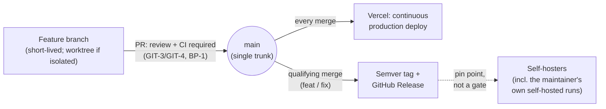

# Git Policy

## Commits: GIT-1

**GIT-1**: Commits MUST represent one logical, coherent, reviewable change — never a grab-bag of unrelated edits, never split so finely that one idea is smeared across several commits.

Rationale: a commit is the smallest unit a future reader (human or agent) can understand, review, or revert in isolation. Bundling unrelated changes together, or fragmenting one change into many, both break that.

## Commits: GIT-2

**GIT-2**: Commit messages MUST use Conventional Commits style (`type(scope): summary`), kept to a single line unless a body is genuinely necessary.

Rationale: a commit is the smallest unit a future reader (human or agent) can understand, review, or revert in isolation. Bundling unrelated changes together, or fragmenting one change into many, both break that.

## Worktrees and branches: GIT-3

**GIT-3**: A worktree MUST be used only when work needs isolation from something concurrent — running multiple tasks or agents in parallel, or deliberately preserving a line of work to return to while switching away to something else mid-session. Ordinary sequential solo work MAY use a plain branch checked out directly in the main checkout instead; it still needs its own branch and goes through its own PR (GH-1) either way — a worktree is about workspace isolation, not a precondition for branching or for opening a PR.

Rationale: the expected end state after any completed or abandoned piece of work is a clean `main` — up to date with `origin/main`, nothing to commit, no stray branches or worktrees. GIT-3's worktree requirement exists to isolate genuinely concurrent work from the main checkout, not to force a dedicated workspace — and a fresh worktree+branch for every single task, regardless of whether anything else is running concurrently, was pushing toward a fresh PR per task too (see GH-1), which was never the intent.

## Worktrees and branches: GIT-4

**GIT-4**: A branch or worktree MUST NOT outlive the task it was created for — deleted in the same action as merging (if the work landed) or abandoning (if the work was discarded), never a separate cleanup step, never left "just in case."

Rationale: the expected end state after any completed or abandoned piece of work is a clean `main` — up to date with `origin/main`, nothing to commit, no stray branches or worktrees. GIT-3's worktree requirement exists to isolate genuinely concurrent work from the main checkout, not to force a dedicated workspace — and a fresh worktree+branch for every single task, regardless of whether anything else is running concurrently, was pushing toward a fresh PR per task too (see GH-1), which was never the intent.

## Branching model

**GIT-7**: This repository MUST follow Trunk-Based Development: a single long-lived branch (`main`), with every other branch short-lived and merged back via PR (GIT-3/GIT-4), never a parallel long-lived branch (a `develop` branch, a release branch, or similar).

Rationale: a single trunk keeps integration continuous and avoids the divergence, merge overhead, and "which branch is actually current" ambiguity of parallel long-lived branches — overhead this project has no multi-track release train to justify.

## Releases: GIT-8

**GIT-8**: Semantic-version release tags MUST be cut automatically from qualifying merges to `main` — no manual release step, and no separate release branch or release PR to batch them.

Rationale: the PR-review-plus-CI gate every merge to `main` already passes through (GIT-1–GIT-4, BP-1) *is* the deliberate checkpoint — re-gating on top of it via a batched release step would duplicate a decision already made at merge time. Release tags exist for a different consumer: self-hosters (including the maintainer's own instance, if ever run outside Vercel) who have no equivalent of "the maintainer just reviewed this," and so need a stable, known-good version to pin to instead of tracking `main` HEAD. See `compliance-audit.md`'s CA-1 for the obligation that this tooling exists at all.

## Releases: GIT-9

**GIT-9**: Release tags MUST NOT gate or delay deployment to the maintainer's own production instance, which deploys continuously from `main` HEAD independently of tagging.

Rationale: the PR-review-plus-CI gate every merge to `main` already passes through (GIT-1–GIT-4, BP-1) *is* the deliberate checkpoint — re-gating on top of it via a batched release step would duplicate a decision already made at merge time. Release tags exist for a different consumer: self-hosters (including the maintainer's own instance, if ever run outside Vercel) who have no equivalent of "the maintainer just reviewed this," and so need a stable, known-good version to pin to instead of tracking `main` HEAD. See `compliance-audit.md`'s CA-1 for the obligation that this tooling exists at all.

## Adding new files

**GIT-5**: A new top-level or structural file (a new top-level doc, a new config file, a new directory convention) MUST be confirmed with the user before it's added. A file that's obviously part of already-approved work — a new component, a new test file for a feature already being built — doesn't need a separate ask.

Rationale: structural files shape how everyone (human or agent) navigates the repo afterward; a silent choice here is much harder to undo cleanly than a silent choice inside an already-scoped piece of work.

## Authentication

**GIT-6**: This repository's own scripts, CI configuration, and documented setup process MUST NOT depend on a credential embedded in the repo or on any personal credential-wrapping setup (an alias, a wrapper script) to function — only on the operator's own directly-configured ambient credentials (an SSH key, a plain `gh auth login`/PAT). This constrains what the *repo* is allowed to require, not what tooling an agent or the operator may use to manage a live session's own credential state: using the operator's own personal credential-management scripts (living outside the repo) to authenticate a session is the operator using their own tooling, not the repo depending on it.

Rationale: a project meant to be self-hosted has to work for someone who's never heard of the original maintainer's personal credential-wrapping setup — that's a constraint on the repo's own self-sufficiency, not a restriction on what tooling an agent or operator may use to manage a live session's credentials. Misreading this as "never use any personal credential tooling, even the operator's own, for anything" would block the operator's own ambient auth-switching scripts from ever fixing a broken session — the opposite of what this rule is for.
