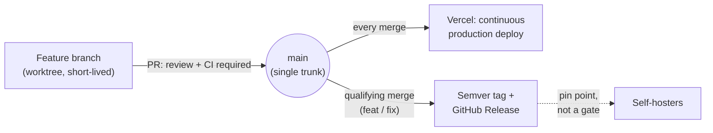

# Contributing to Riposte

Riposte is currently a single-maintainer project, but these procedures hold regardless
of whether that stays true. If you're an agent working in this repo, see `CLAUDE.md`
for the same rules in agent-operational form — this document is the narrative version.

## Before you start: which kind of change is this?

- **Adds or changes product behavior** → work through Spec Kit end to end:
  `speckit-specify`, then `speckit-clarify`, `speckit-plan`, `speckit-tasks`,
  `speckit-implement`. See
  [`.policy/feature-start.md`](.policy/feature-start.md).
- **A trivial, unambiguous fix** (typo, obviously-correct one-line bug fix) → skip
  straight to a normal commit. When in doubt, treat it as the first case.

## Working with git

- One logical change per commit; write messages in Conventional Commits style
  (`type(scope): summary`), a single line unless a body is genuinely needed.
- Any branch/PR-bound work gets its own worktree.
- When a PR merges, delete its branch and worktree in the same action. The expected
  end state after finishing any piece of work is a clean `main`: up to date with
  `origin/main`, nothing to commit, nothing left behind.
- Ask before adding a new top-level file or directory convention; a file that's
  obviously part of already-approved work doesn't need a separate ask.
- Use your own ambient git/GitHub credentials (SSH key, `gh auth login`). Nothing in
  this repo should ever need a personal credential-wrapping setup to function.
- This repo follows Trunk-Based Development: one long-lived branch (`main`), every
  other branch short-lived and merged back via PR. There's no `develop` branch, no
  release branch — just `main` and whatever worktree you're currently working in.
- Release tags are cut automatically from qualifying merges to `main` — there's no
  manual release step to run. They exist so self-hosters have a known-good version to
  pin to; they don't gate or delay the maintainer's own continuous deployment, which
  tracks `main` HEAD directly (the PR review your change just went through is already
  that gate).

Full rationale: [`.policy/git.md`](.policy/git.md).

## Opening a pull request

Every change — including a one-line doc fix — goes through a pull request. That's a
constraint on commits never skipping a PR, not on how many commits one PR holds — a
PR can be a single commit or several related ones batched together. Pushing a
branch doesn't by itself mean it's time to open the PR — that's always a separate
decision, never assumed just because a branch exists.

1. Run the full local quality gate (type-check, lint, format, test) — the same
   commands CI runs — and confirm it's green before opening.
2. Fill out `.github/PULL_REQUEST_TEMPLATE.md` section by section against what
   actually changed. Don't write a freeform description instead.
3. Open the PR against `main`.
4. A human merges every PR, always — never an automated process, regardless of CI
   status.

Full rationale: [`.policy/github.md`](.policy/github.md).

## Keeping process commitments honest

CI includes a non-blocking check, on pushes to `main`, that a handful of foundational
practices — release automation, self-host packaging, self-host documentation,
security hardening for external content, the demo path, no hardcoded identities, the
committed-vs-personal boundary — still hold. Any gap it finds becomes a GitHub issue labeled `process-hygiene`; that
label is the current source of truth for what's outstanding.

`main`'s branch protection is a checked-in ruleset rather than a page in GitHub's UI.
Changing it always needs the maintainer's own broader-scoped access. Reading or
verifying its current state doesn't — day-to-day credentials can do that once they
carry read-only GitHub Administration access.

Full rationale: [`.policy/compliance-audit.md`](.policy/compliance-audit.md),
[`.policy/branch-protection.md`](.policy/branch-protection.md).

## Visibility: what goes in this repo

If you're unsure whether something belongs in a committed file: would a stranger
picking up this repo cold find it useful or need it? If yes, commit it. If no, it
belongs in a gitignored local file or your own notes, not in the repo — see
[`.policy/visibility.md`](.policy/visibility.md) for the full test.
